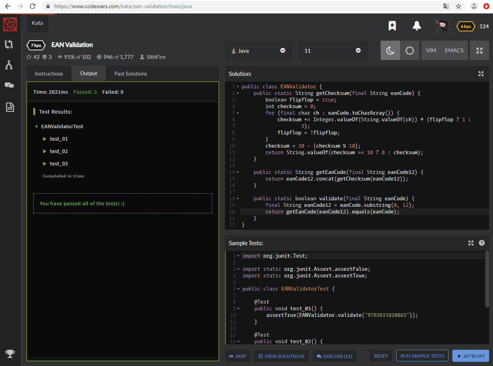
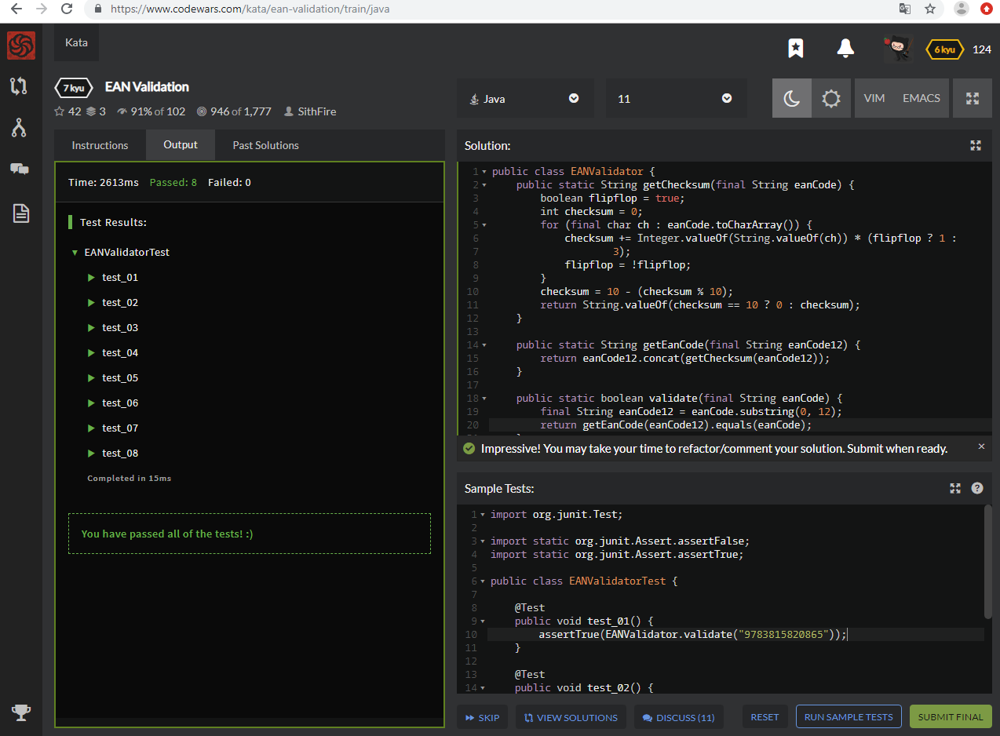

# EAN Validation kata
A lot of goods have an International Article Number (formerly known as "European Article Number") abbreviated "EAN". EAN is a 13-digits barcode consisting of 12-digits data followed by a single-digit checksum (EAN-8 is not considered in this kata). 

The single-digit checksum is calculated as followed (based upon the 12-digit data):

The digit at the first, third, fifth, etc. position (i.e. at the odd position) has to be multiplied with "1". 
The digit at the second, fourth, sixth, etc. position (i.e. at the even position) has to be multiplied with "3".
Sum these results. 

If this sum is dividable by 10, the checksum is 0. Otherwise the checksum has the following formula:

checksum = 10 - (sum mod 10)

For example, calculate the checksum for "400330101839" (= 12-digits data):

4·1 + 0·3 + 0·1 + 3·3 + 3·1 + 0·3 + 1·1 + 0·3 + 1·1 + 8·3 + 3·1 + 9·3
= 4 + 0 + 0 + 9 + 3 + 0 + 1 + 0 + 1 + 24 + 3 + 27 
= 72
10 - (72 mod 10) = 8 ⇒ Checksum: 8

Thus, the EAN-Code is 4003301018398 (= 12-digits data followed by single-digit checksum).

## Your Task
Validate a given EAN-Code. Return true if the given EAN-Code is valid, otherwise false.

## Assumption
You can assume the given code is syntactically valid, i.e. it only consists of numbers and it exactly has a length of 13 characters.

## Examples
EANValidator.validate("4003301018398") // true
EANValidator.validate("4003301018392") // false

